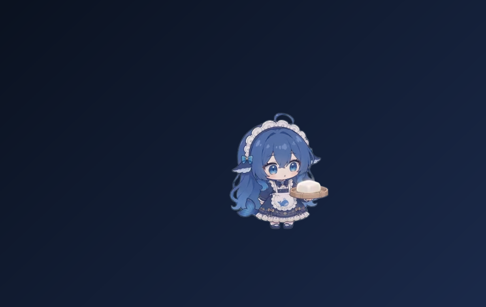
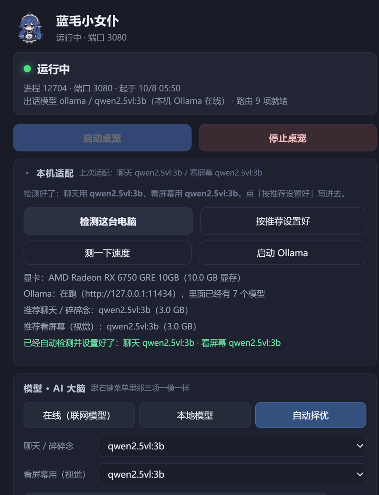
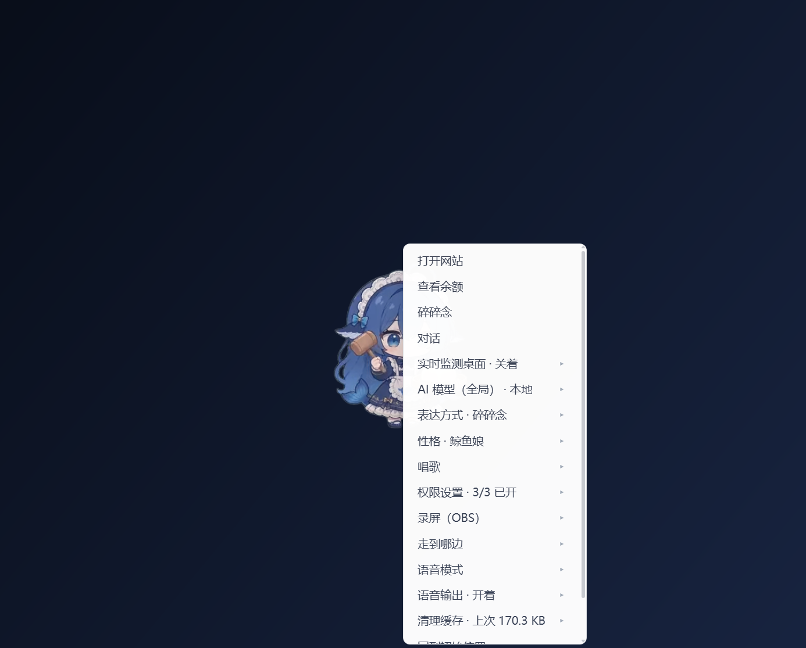
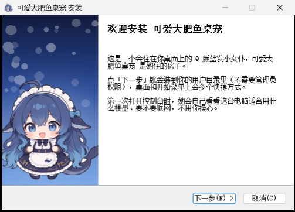

<div align="center">

# Cute Fat Fish Pet

**A transparent little maid who lives on your Windows desktop. Her name is "Blue-Haired Little Maid" (蓝毛小女仆).**

She idles, wanders around and does little animations on her own. She can chat with you, take a look at your screen and say something about it — and when you ask her to, she can open an app, a file, a folder or a web page for you, or start a screen recording.



[Install](#install) · [First run](#what-she-does-on-first-run) · [Data & privacy](#data--privacy) · [Build from source](#build-from-source) · [Verify your download](#verify-your-download) · [License](#license--third-party)

**English** · [中文文档](README.zh-CN.md)

</div>

---

## About this project

Cute Fat Fish Pet is an independent desktop-pet project, developed and maintained by **Mikolu**.

Special thanks to **PC2005-cloud**, whose **dsh-pet 0.3.0** provided the early foundation and the inspiration for this project.

The pet engine in [`src/`](src) is that codebase, carried forward and maintained in-tree: of the 243 files in the published upstream `dsh-pet@0.3.0` package, **232 are byte-identical here and 11 were changed on purpose** (each one listed with sizes and reasons in [docs/differences-from-upstream.md](docs/differences-from-upstream.md)), **no upstream file was dropped**, and two engine files (`runtime/electron-helper/obs-ctl.js`, `stt-worker.mjs`) are ours. Everything else in this repository — the console, the standalone runner, the build chain, the installer, the docs — is this project's own work.

There is no patching step any more: `src/` **is** the shipped source. Building is just laying the source tree out in release shape and adding the runtimes that are not kept in git.

| | |
| --- | --- |
| Product name | Cute Fat Fish Pet (可爱大肥鱼桌宠) |
| The character | Blue-Haired Little Maid (蓝毛小女仆) |
| Author / maintainer | Mikolu |
| Version | 1.1.4 |
| License | MIT — see [LICENSE](LICENSE) |

### Internal identifiers are kept on purpose (`dsh-pet` / `BlueHairMaid`)

Everything the user can see has been renamed. Nothing on the inside has — on purpose:

| Internal identifier | Value | What breaks if it is renamed |
| --- | --- | --- |
| App folder / APP_ID / uninstall entry | `BlueHairMaid` | Existing config, data, shortcuts and "Apps & features" entry no longer match — it becomes a second pet |
| Pet plugin package name | `dsh-pet` | Data root and plugin load path change; her persona and memory "move house" |
| Desktop renderer package | `dsh-pet-electron-helper` | The pet page's localStorage (position, size, sprite state) is lost and she is put back in the middle of the screen |
| Browser storage keys | `dsh-pet-*` | Same as above — all existing settings are ignored |
| Local route prefix | `/dsh-pet-7340` | Incompatible with the already-shipped versions; console and pet stop understanding each other |
| User data directory | `%APPDATA%\BlueHairMaid` | Existing persona / memory / screen-watch state is lost |

In short: **rename what is visible, never touch what is not.** That is what makes upgrading from 1.0.0 a no-op for the user.

The same list is in [NOTICE.md](NOTICE.md) (section 5), and the reasoning behind it is in [docs/architecture-roadmap.zh-CN.md](docs/architecture-roadmap.zh-CN.md).

---

## What she can do



- **She moves on her own** — 106 hand-drawn transparent animations (VP9-alpha webm, composited onto your wallpaper with a screen blend). Idle breathing, looking around, walking to random spots, random small gestures. Animation weights and frequency are configurable.
- **She talks with you** — click her to open the chat. Local models through [Ollama](https://ollama.com/) or any OpenAI-compatible endpoint; the console has three modes: **Local**, **Auto (best available)** and **Online**.
- **She can watch your screen** (optional, switchable) — a screenshot every so often is handed to a vision model and she comments on it. With no vision model configured this path stays off instead of sending a random image.
- **She mutters and speaks up** — she fills quiet moments on her own, and can be driven by work state (task started / finished / failed).
- **She can do things for you (your call)** — open an app, a file, a folder or a URL; screen recording goes to OBS or to whatever software you pick, saved wherever you pick. Three permission switches turn this off completely.
- **Voice** — speech input runs fully offline inside the package (sherpa-onnx + SenseVoice int8); her voice uses Edge TTS + SSML, with adjustable rate and pitch (the pitch is stored in the data root).
- **One single-HTML console** — start / stop, status, models and "AI brain", voice, permissions, recording, logs: all in one window, no command line.
- **Persona and memory** — persona files, chat history and screen-watch state live in the data root; you can edit them and back the whole thing up.



---

## Install

### Option 1 — installer (recommended)

Download **`cute-fat-fish-pet-1.1.4-setup.exe`** (about 330 MB, NSIS) and double-click it.

> **Always-latest link:** every release also carries a byte-identical copy without the version in
> its name, so this one link always points at the newest installer:
> <https://github.com/12we21/cute-fat-fish-pet/releases/latest/download/cute-fat-fish-pet-setup.exe>

- Installs to `%LOCALAPPDATA%\BlueHairMaid` by default — **no administrator rights needed**.
- Want it elsewhere (D: drive, external disk)? Change it on the "Choose install location" page. Start-menu entry and desktop shortcut are created for you.
- The package already contains the Electron runtime, the speech engine and models, and the real `node.exe` used for speech recognition, so it works **offline** right after installing.



### Option 2 — portable zip

Download **`cute-fat-fish-pet-1.1.4-win-x64.zip`** (about 400 MB, ~760 MB unpacked), unpack it anywhere, then pick one:

> **1.1.1 fixed this path end to end.** Unpack the zip **first** (right-click → *Extract All…*) and only then double-click
> `安装.cmd` inside the extracted folder. It checks that the package is complete and explains the problem in Chinese if it
> is not (the old one just flashed and closed), installs under the name 「可爱大肥鱼桌宠」 with the real version number, and
> `卸载.cmd` now really removes the directory instead of leaving all 714 files behind.
> Details: [release notes 1.1.4](docs/release-notes-1.1.4.md) · [confirmed defects](docs/known-issues.md).

- double-click `安装.cmd` — creates the shortcuts and the uninstall entry (as if it had been installed), or
- double-click `standalone\start-pet.vbs` to start her and `standalone\stop-pet.vbs` to stop her (fully portable, writes no registry keys).

Use the second one on a USB stick. If you want her data to travel with the program directory, drop an empty `portable.txt` next to the executable (see [Data & privacy](#data--privacy)).

> Note: the files that ship **inside** the package keep their Chinese names and Chinese text for now (`安装.cmd`, `卸载.cmd`, `assets\使用说明.txt`, …). Renaming them would change the package that is already published, so it is queued for the next release instead.

### Every download comes with a `.sha256`

`cute-fat-fish-pet-1.1.4-setup.exe.sha256` and `cute-fat-fish-pet-1.1.4-win-x64.zip.sha256`, in the format `<SHA256>  <filename>`:

```powershell
Get-FileHash .\cute-fat-fish-pet-1.1.4-setup.exe -Algorithm SHA256
```

> Release file names are ASCII on purpose: GitHub Releases deletes non-ASCII characters from
> asset names (a Chinese name is uploaded as `-1.1.0-.exe`). Chinese stays in the product name,
> the shortcuts and "Apps & features".

### Start, stop, uninstall

- **Start**: double-click the desktop shortcut "可爱大肥鱼桌宠" to open the **console**, then press **启动桌宠** ("Start the pet").
  The console does **not** pull her up by itself — that is deliberate, so that changing a setting does not make her pop out first.
- **Stop**: press stop in the console, or double-click `standalone\stop-pet.vbs`.
- **Autostart and auto-update are not implemented yet.** If you want autostart, put a shortcut to the console into your Startup folder.
- **Uninstall**: "可爱大肥鱼桌宠" in Settings → Apps, or `卸载.cmd` in the install directory.
  Uninstalling **does not** delete your data (persona, memory, chat history stay). To remove everything, delete the data directory yourself (next section).

### Updating to a newer version

There is **no automatic updater yet** — updating means downloading the new installer and running it over the old copy. Only program files are replaced; your data is not touched.

1. **Close the pet first.** Right-click her tray icon → exit, or double-click `standalone\stop-pet.vbs`.
   The installer deliberately never kills processes (it must not kill a *different* pet on the same PC), so while `electron.exe` is running it stops and asks you to close her.
2. **Download the new installer** — the always-latest link above, or the newest release on the [releases page](https://github.com/12we21/cute-fat-fish-pet/releases).
3. **Double-click it and click Next.** The installer reads the folder used by the previous version from `HKCU\Software\Microsoft\Windows\CurrentVersion\Uninstall\BlueHairMaid` and installs **back into the same folder**, so you do not end up with a second 761 MB copy. The desktop and Start-menu shortcuts are recreated.
4. **Start her again** from the console.

What survives: persona, memory, chat history, settings and model configuration live in the data directory (`%APPDATA%\BlueHairMaid`), which the installer never touches.

Portable zip: unpack the new zip over the old folder. Keep your own `standalone\online.json` (your online-model settings) and your `portable.txt` if you made one.

> Scripted installs: `cute-fat-fish-pet-setup.exe /S /D=D:\path\to\install`. Two things to know — silent mode does **not** auto-detect the previous folder, so pass `/D=` yourself, and it will not replace files while she is running.

---

## What she does on first run

You do not have to configure anything. On the first start she does a "local fit" round:

1. **Looks at your GPU** — reads the VRAM size from the registry to decide the model context size and when to unload it (the result is written to `device-profile.json`).
2. **Finds local models** — lists the models already pulled into Ollama and picks one as the chat model, plus a vision model for screen watching if there is one.
3. **Seeds the defaults** — copies the bundled default persona / animation config / screen-watch config into the data root. **Only missing files are added; files you edited are never overwritten.**
4. **Writes a run record** — `runtime.json` (pid, port, model, start time), removed on exit; it is the first place to look when she does not come up.

She also runs with **no model at all**: she will idle, wander and gesture, she just will not speak. To give her a voice, install [Ollama](https://ollama.com/) and pull a model, or fill in an OpenAI-compatible endpoint (base URL + key + model name) under **模型 · AI 大脑 → 联网模型** in the console.

---

## Data & privacy

### Where the data lives

Treat the program directory (`%LOCALAPPDATA%\BlueHairMaid`) as **read-only**. Everything that changes lives in the user data directory, resolved in this order:

1. environment variable `DSH_PET_DATA_DIR` (testing / advanced use)
2. `data-root.txt` in the program directory (one line: the path)
3. `portable.txt` in the program directory → data goes to `<program dir>\userdata\` (portable mode)
4. **default** `%APPDATA%\BlueHairMaid\`

```
%APPDATA%\BlueHairMaid\
├─ dsh-pet\
│  ├─ main-config.json          persona + pet list
│  ├─ screen-watch\state.json   screen-watch config and state, brain mode, local models
│  ├─ record.json               recording settings (which app, where to save)
│  ├─ tts-pitch.txt             voice pitch (default +0Hz)
│  └─ main-animation\           your own animation assets (used with priority if present)
├─ device-profile.json          result of the automatic first-run fit
├─ runtime.json                 run record (pid / port / model), deleted on exit
├─ console\                     console window state
└─ logs\
   ├─ runner.log / runner.err.log     host-side logs
   └─ pet-control.log                 console start/stop log
```

The pet page's own localStorage (position, size, sprite state) lives in `%APPDATA%\dsh-pet-electron-helper` — that is Electron's rule, which is why it is part of the "internal identifiers are kept" note above.

### Privacy

- **Screen watching** is **a local screenshot handed to the model you chose**. Pick a local Ollama model and nothing leaves your machine; pick an online model and the image goes to the endpoint you configured. Turn it off in the console and no screenshot is taken at all.
- **Speech recognition runs offline**: sherpa-onnx + SenseVoice int8 are inside the package and need no network.
- **Edge TTS needs the network** (it uses Microsoft's online speech synthesis).
- **Online model API keys are stored in plain text** in `standalone\online.json` (in the program directory). It is a local file meant for you only — do not send this file to anyone, and do not upload a directory that contains it.
- **She never phones home**: no telemetry, no usage reporting. Only the online features you turn on (online models, Edge TTS) use the network.
- Uninstalling keeps your data; delete `online.json` and the data root yourself if you want them gone.

More detail, including the local control-bridge hardening added in 1.1.0, is in [SECURITY.md](SECURITY.md).

---

## Repository layout

### Source repository

```
.
├─ src\               shipped source: the pet engine (host side + browser side), pet page, bundled node_modules
│  ├─ lib\           index.js (host side, a Cordis plugin: name/inject/apply), client.js (browser side)
│  ├─ src\           TypeScript sources (host / client / shared); lib\ is the build output
│  ├─ assets\        animation webm, memes, images, fonts, config.jsonc
│  └─ runtime\electron-helper\   desktop renderer (transparent Electron window + its own renderer)
├─ launcher\          console: single HTML + Electron shell (main.js / pet-api.js / rec.js / paths.js)
├─ standalone\        standalone-mode runner: fake ctx (context.mjs) + a real http server (server.mjs)
│  └─ shims\          stand-ins for three DSH packages (home-paths / credentials / llm)
├─ defaults\          default files seeded into the data root on first run
├─ build\             packaging: build.mjs (lays out stage\), toolchain.mjs (locates runtimes),
│                     check-paths.mjs (privacy gate), installer.nsi, mkexe.py, mkzip.py
├─ assets\            install / uninstall scripts and the shipped text files
├─ docs\              release notes, dev log, upstream diff, roadmap, publishing, code signing, images
├─ verify.mjs         released-package self-check (tree fingerprints + privacy file check)
└─ package.json       build entry points (npm run build / exe / zip / verify / paths)
```

### After installing

```
<install dir>\
├─ app\               ← src\ laid out here (the pet engine)
├─ electron\          Electron 43 runtime (not in git)
├─ node\              a real node.exe for speech recognition (not in git)
├─ speech\            sherpa-onnx engine + SenseVoice int8 model (not in git)
├─ launcher\          console
├─ standalone\        standalone runner + the two .vbs launchers
├─ defaults\          default configuration
├─ assets\            shipped text files and install/uninstall scripts
├─ 卸载.cmd           uninstall
└─ verify.mjs         self-check
```

---

## Build from source

**Requirements**: Windows x64, Node.js 24, Python 3 (packaging scripts), [NSIS 3](https://nsis.sourceforge.io/) (to build the installer).

**The three runtime pieces (~689 MB) are not in git** and have to come from somewhere:

| Piece | What it is | Size |
| --- | --- | --- |
| `electron\` | Electron 43.3.0 win-x64 | ~347 MB |
| `node\` | node v24.21.0 win-x64 (the SenseVoice native addon cannot be loaded inside Electron: `External buffers are not allowed`, so a real node.exe is required) | ~89 MB |
| `speech\` | sherpa-onnx native engine + SenseVoice int8 model | ~253 MB |

The easy way is to point the build at **an already installed copy of Cute Fat Fish Pet**, which has all three:

```powershell
npm run toolchain                                   # show what is missing and where to get it
node build\build.mjs --toolchain <an installed Cute Fat Fish Pet directory>   # lay out stage\
npm run exe                                         # python build\mkexe.py  → release\cute-fat-fish-pet-<version>-setup.exe
npm run zip                                         # python build\mkzip.py  → release\cute-fat-fish-pet-<version>-win-x64.zip
npm run verify                                      # check the stage\ tree fingerprints (should be all OK)
npm run paths                                       # build-time privacy gate: no local absolute paths, no private dirs
```

The two commands used most while developing:

```powershell
node build\build.mjs launcher assets   # rebuild only these blocks
node build\build.mjs --list            # show what it would do, touch nothing
```

Blocks: `app launcher standalone defaults assets verify electron node speech`.

Artifact names come from the `version` field in `src\package.json` and are ASCII-only (GitHub Releases drops non-ASCII asset names), so this version produces `cute-fat-fish-pet-1.1.4-setup.exe` and `cute-fat-fish-pet-1.1.4-win-x64.zip`.

> The build contract lives in the header of `build\build.mjs` and in the root `package.json` scripts.
> `build\check-paths.mjs` is a build gate; `--no-gate` skips it (not recommended).

---

## Tech stack

- **Desktop rendering** — one transparent, borderless Electron 43 window per pet; plain JS + Canvas playing VP9-alpha webm, screen-blended onto the wallpaper. The window follows the pet's bounding box and is click-through by default, becoming interactive only when the cursor is inside her body.
- **Host side** — one file, [`src\lib\index.js`](src/lib/index.js), lives two lives: inside DSH it is a Cordis plugin (`name/inject/apply`); in standalone mode `standalone\main.mjs` redirects three `@deepseek-ai/*` packages to `standalone\shims\` at run time, feeds it a "just enough" fake ctx (`standalone\context.mjs`) and calls the very same `apply(ctx)`.
- **Console** — a single HTML file (`launcher\index.html`) plus an Electron shell, IPC into `pet-api.js`; start/stop goes through `standalone\main.mjs` / `stop-pet.mjs`.
- **Models** — local Ollama, or any OpenAI-compatible endpoint (`/chat/completions`, vision through `image_url`); balance lookup uses DeepSeek's `/user/balance`.
- **Speech** — sherpa-onnx + SenseVoice int8 + silero VAD for offline recognition; Edge TTS + SSML for synthesis.
- **Console ↔ pet channel** — a loopback control bridge, hardened in 1.1.0 with token auth and a CORS allow-list (see the [release notes](docs/release-notes-1.1.0.md) and [SECURITY.md](SECURITY.md)).
- **Packaging** — Node + Python scripts lay out `stage\`; NSIS 3 builds the installer, a Python script builds the portable zip.

---

## Verify your download

1.1.4 artifacts:

| File | Size (bytes) | SHA-256 |
| --- | --- | --- |
| `cute-fat-fish-pet-1.1.4-setup.exe` | 347880285 | `495F5D3506C419B7967513E3F8C73F655F108FAC965BFF58B643EE018553C5D0` |
| `cute-fat-fish-pet-1.1.4-win-x64.zip` | 417002153 | `54F6832CCC6D609FC26497F12B54EE9DA4016E8ACA2F144246AC0F23CC9542FC` |

The same hashes are in the `.sha256` files next to each asset, and in the release notes.

Inside the installed package, `verify.mjs` re-checks the whole `app\` tree, its own files and the files that must **not** be there:

```powershell
node verify.mjs
```

The build also enforces this from the other side: `build\check-release.mjs` proves that `stage\` matches the repository byte for byte.

---

## Documentation

| Document | What is in it |
| --- | --- |
| [docs/development-log.md](docs/development-log.md) | Development log: motivation → change → verification → commit, for every step of this project |
| [docs/differences-from-upstream.md](docs/differences-from-upstream.md) | Every file that differs from upstream dsh-pet 0.3.0, with sizes and SHA-256 |
| [docs/release-notes-1.1.4.md](docs/release-notes-1.1.4.md) | 1.1.4 release notes — the console keeps your API key masked while you record |
| [docs/release-notes-1.1.3.md](docs/release-notes-1.1.3.md) | 1.1.3 release notes — 「打开 X」 opens a website, a folder or a file, by voice as well as typed |
| [docs/release-notes-1.1.2.md](docs/release-notes-1.1.2.md) | 1.1.2 release notes — the online model stops saying its thinking out loud |
| [docs/release-notes-1.1.1.md](docs/release-notes-1.1.1.md) | 1.1.1 release notes — the portable zip installs and uninstalls on a double-click |
| [docs/release-notes-1.1.0.md](docs/release-notes-1.1.0.md) | 1.1.0 release notes (first public release) |
| [docs/architecture-roadmap.zh-CN.md](docs/architecture-roadmap.zh-CN.md) | Architecture roadmap: host-coupling removal, control-bridge security, long-term plans (Chinese) |
| [docs/how-to-publish.zh-CN.md](docs/how-to-publish.zh-CN.md) | How a release is published (Chinese) |
| [docs/code-signing.zh-CN.md](docs/code-signing.zh-CN.md) | Code signing: options, costs, what it would take (Chinese) |
| [docs/history/](docs/history) | Older release notes, kept for the record |
| [SECURITY.md](SECURITY.md) | Threat model and hardening of the local ports |
| [CONTRIBUTING.md](CONTRIBUTING.md) | How to build, test and send a change |
| [NOTICE.md](NOTICE.md) | Copyright, attribution and third-party components |

---

## License & third party

- This project is released under the **MIT** license — see [`LICENSE`](LICENSE), which carries **two** copyright lines: PC2005-cloud (upstream dsh-pet) and Mikolu (this integrated release).
- **The upstream MIT text ships unmodified**: [`assets/LICENSE.txt`](assets/LICENSE.txt) is byte-identical to the upstream file, with the original author's attribution intact.
- Third-party components (Electron / Chromium, Node.js, sherpa-onnx, the SenseVoice model, silero VAD, npm dependencies, Edge TTS, online model endpoints) are listed one by one in [`assets/第三方声明.txt`](assets/第三方声明.txt). Ollama is **not** bundled — install it yourself.
- More detail: [NOTICE.md](NOTICE.md).

---

## Contact

She started as something I wrote for my own desktop. Questions, ideas, feature requests: open an **issue in this repository**.

If she makes your desktop a little cuter, that is enough.
